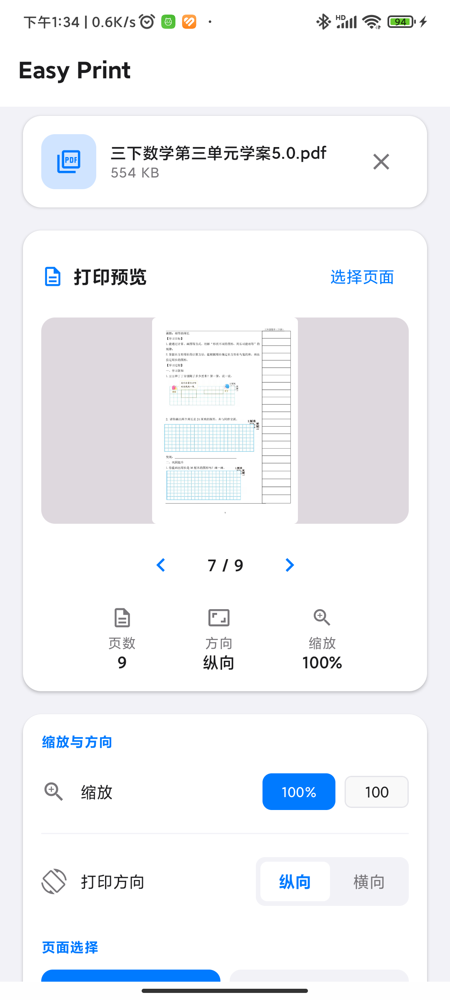
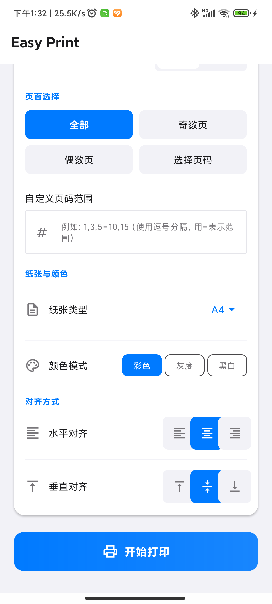

# Easy Print

<p align="center">
  
</p>

<p align="center">
  <strong>一款功能丰富的 Android 打印工具</strong>
</p>

<p align="center">
  <a href="https://github.com/anyangmvp/easy-print/releases">
    
  </a>
  <a href="https://github.com/anyangmvp/easy-print/stargazers">
    
  </a>
  <a href="https://github.com/anyangmvp/easy-print/fork">
    
  </a>
</p>

---

## 功能特性

### 文件支持
- **PDF 文档** — 高保真预览与打印 PDF 文件，支持 600 DPI 高清渲染
- **图片** — 支持 JPG、PNG 等常见图片格式，自动保持原始比例
- **文本文件** — 直接在应用内预览纯文本文件
- **其他文件** — 代码文件、Markdown 等

### 打印设置
- **纸张尺寸** — A3、A4、A5、A6、B4、B5、Letter、Legal、Tabloid
- **缩放控制** — 自定义缩放 1% ~ 500%
- **页面方向** — 纵向 / 横向
- **对齐方式** — 水平（左/中/右）、垂直（上/中/下）
- **颜色模式** — 彩色、灰度、黑白

### 页面选择
- **全部页面** — 打印整个文档
- **奇/偶数页** — 快速选择奇数页或偶数页
- **自定义范围** — 手动输入页码，如 `1,3,5-8`
- **可视化预览** — 带翻页控制的页面预览

### 网络打印机发现
- **自动扫描** — 自动发现局域网内的打印机（端口 9100）
- **手动添加** — 通过 IP 地址添加打印机
- **记忆保存** — 记住已使用过的打印机，下次打开自动加载

### 分享集成
- **接收分享** — 通过 Android 分享菜单从其他应用接收文件
- **直接打开** — 在文件管理器中直接打开支持格式的文件

---

## 截图

<p align="center">
    
    
</p>

---

## 系统要求

- **Android 11**（API 30）及以上
- **网络连接**（用于扫描局域网打印机）

---

## 安装

### 通过 Release 安装
1. 前往 [Releases](https://github.com/anyangmvp/easy-print/releases) 下载最新 APK
2. 在系统设置中开启「允许安装未知来源应用」
3. 打开 APK 文件完成安装

### 从源码构建
```bash
# 克隆仓库
git clone https://github.com/anyangmvp/easy-print.git

# 进入项目目录
cd easy-print

# 构建 Debug APK
gradle assembleDebug

# 安装到设备
adb install app/build/outputs/apk/debug/Easy\ Print-*.apk
```

---

## 技术栈

| 分类 | 技术 |
|------|------|
| **框架** | Android Jetpack Compose |
| **语言** | Kotlin 2.0 |
| **架构** | MVVM + ViewModel |
| **状态管理** | Kotlin StateFlow |
| **数据持久化** | Jetpack DataStore |
| **图片加载** | Coil |
| **PDF 渲染** | Android PdfRenderer |
| **构建工具** | Gradle 9.x |

---

## 项目结构

```
app/src/main/java/me/anyang/easyprint/
├── MainActivity.kt          # 应用入口
├── data/                     # 数据层
│   ├── PrintSettings.kt     # 打印配置模型
│   └── PrinterDataStore.kt  # 打印机持久化存储
├── print/                    # 打印功能
│   ├── PdfGenerator.kt      # PDF 生成引擎（600 DPI 高清渲染）
│   ├── NetworkPrinterScanner.kt  # 局域网打印机扫描
│   └── GeneratedPdfPrintDocumentAdapter.kt  # 打印适配器
├── ui/                       # UI 层
│   ├── components/          # 可复用组件
│   │   ├── FilePickerCard.kt
│   │   ├── PrintPreview.kt
│   │   ├── PrintSettingsPanel.kt
│   │   └── PrinterSelector.kt
│   ├── screens/             # 页面
│   │   └── HomeScreen.kt
│   └── theme/               # 主题
│       ├── Theme.kt
│       └── Type.kt
└── viewmodel/                # ViewModel 层
    └── PrintViewModel.kt
```

---

## 许可证

本项目基于 [MIT License](LICENSE) 开源。

---

## 贡献

欢迎提交 Pull Request 参与贡献！

---

<p align="center">
  Made with ❤️ by <a href="https://github.com/anyangmvp">Stephen An</a>
</p>
