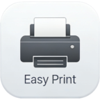

# Easy Print

<p align="center">
  
</p>

<p align="center">
  <strong>A beautiful Android print utility app with advanced features</strong>
</p>

<p align="center">
  <a href="https://github.com/anyangmvp/easy-print/releases">
    
  </a>
  <a href="https://github.com/anyangmvp/easy-print/stargazers">
    
  </a>
  <a href="https://github.com/anyangmvp/easy-print/fork">
    
  </a>
</p>

---

## Features

### 📄 File Support
- **PDF Documents** - Preview and print PDF files with full fidelity
- **Images** - Support for JPG, PNG, and other common image formats
- **Text Files** - Preview plain text files directly in the app
- **Other Files** - Code files, markdown, and more

### 🖨️ Advanced Print Settings
- **Paper Size Selection** - A4, A5, A3, Letter, Legal, and more
- **Scaling Control** - Custom zoom from 1% to 500%
- **Orientation** - Portrait and landscape modes
- **Alignment** - Left, Center, Right (horizontal) and Top, Center, Bottom (vertical)
- **Color Modes** - Color, Grayscale, and Black & White options

### 📑 Page Selection
- **All Pages** - Print entire document
- **Odd/Even Pages** - Quick selection for odd or even numbered pages
- **Custom Range** - Manually select specific pages to print
- **Visual Preview** - See selected pages with page navigation controls

### 🔍 Network Printer Discovery
- **Auto Scan** - Automatically discover printers on your network (Port 9100)
- **Manual Add** - Add printers by IP address
- **Persistent Storage** - Remembers previously used printers

### 📱 Share Integration
- **Receive via Share** - Get files from other apps through Android's share menu
- **Direct Open** - Open files directly in the app

---

## Screenshots

<p align="center">
  
  
  
</p>

---

## Requirements

- **Android 11** (API 30) or higher
- **Network Connection** (for network printer discovery)

---

## Installation

### From Release
1. Download the latest APK from [Releases](https://github.com/anyangmvp/easy-print/releases)
2. Enable "Install from unknown sources" in settings
3. Open and install the APK

### From Source
```bash
# Clone the repository
git clone https://github.com/anyangmvp/easy-print.git

# Navigate to project directory
cd easy-print

# Build debug APK
gradle assembleDebug

# Install to device
adb install app/build/outputs/apk/debug/Easy\ Print-*.apk
```

---

## Tech Stack

| Category | Technology |
|----------|------------|
| **Framework** | Android Jetpack Compose |
| **Language** | Kotlin 2.0 |
| **Architecture** | MVVM with ViewModel |
| **State Management** | Kotlin StateFlow |
| **Data Persistence** | Jetpack DataStore |
| **Image Loading** | Coil |
| **PDF Rendering** | Android PdfRenderer |
| **Build System** | Gradle 9.x |

---

## Project Structure

```
app/src/main/java/me/anyang/easyprint/
├── MainActivity.kt          # Entry point
├── data/                     # Data layer
│   ├── PrintSettings.kt     # Print configuration models
│   └── PrinterDataStore.kt  # Printer persistence
├── print/                    # Print functionality
│   ├── PdfGenerator.kt      # PDF generation engine
│   ├── NetworkPrinterScanner.kt  # Printer discovery
│   └── GeneratedPdfPrintDocumentAdapter.kt  # Print adapter
├── ui/                       # UI layer
│   ├── components/          # Reusable components
│   │   ├── FilePickerCard.kt
│   │   ├── PrintPreview.kt
│   │   ├── PrintSettingsPanel.kt
│   │   └── PrinterSelector.kt
│   ├── screens/             # Screen composables
│   │   └── HomeScreen.kt
│   └── theme/               # App theming
│       ├── Theme.kt
│       └── Type.kt
└── viewmodel/                # ViewModels
    └── PrintViewModel.kt
```

---

## License

This project is licensed under the MIT License - see the [LICENSE](LICENSE) file for details.

---

## Contributing

Contributions are welcome! Please feel free to submit a Pull Request.

---

<p align="center">
  Made with ❤️ by <a href="https://github.com/anyangmvp">anyangmvp</a>
</p>
